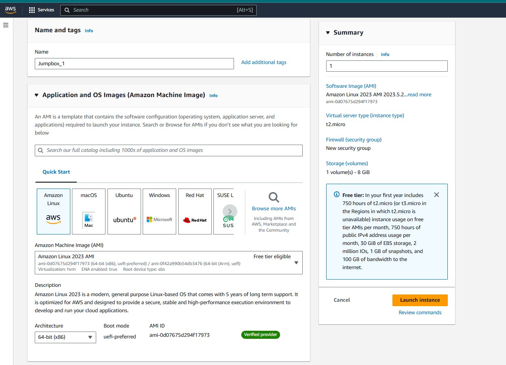
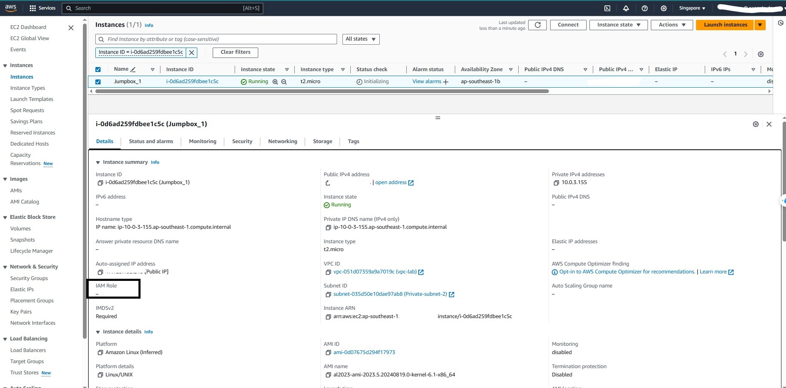
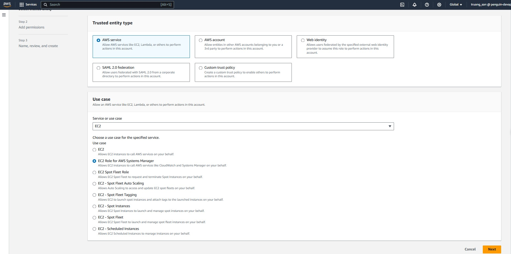

+++
title = "Tạo EC2 và IAM Role cho phép Session Manager quản lý"
date = 2024
weight = 2
chapter = false
pre = "<b>2.2. </b>"
+++

{}
Phần này sẽ có 2 bước, đầu tiên là tạo **EC2** Intance ở public subnet và cài đặt các package cần thiết, sau đó là tạo **IAM Role** để gắn vào EC2 cho phép **Session Manager** có thể quản lý
{}

- [Tạo EC2](#tạo-ec2)
- [Khởi tạo IAM Role](#khởi-tạo-iam-role)
- [Kiểm tra ở Session Manager](#kiểm-tra-ở-session-manager)

#### Tạo EC2

1. Trên thanh tìm kiếm tìm **EC2** và chọn để vào màn hình quản lý EC2. Sau đó nhấn **Launch instances** để khởi tạo
   
2. Thực hiện theo các bước sau để khởi tạo cấu hình cho EC2  
   _Chọn cấu hình OS_
   
   _Khởi tạo keypair để SSH_
   
   {}
   Lưu lại keypair để có thể SSH vào EC2
   {}
   _Cấu hình network cho EC2_
   
   {}
   EC2 ở public subnet, gắn public security group.
   {}

Sau khi làm xong các bước trên thì xem lại thông tin và nhấn **Launch intance** để khởi tạo.

**Chi tiết các thông tin của EC2**

3. Dùng MobaXTerm để thử kết nối SSH tới EC2 Instance vừa tạo
   

4. Cài đặt amazon-ssm-agent bằng câu lệnh  
   `sudo yum install -y https://s3.amazonaws.com/ec2-downloads-windows/SSMAgent/latest/linux_amd64/amazon-ssm-agent.rpm`

5. Vì ở lab này chúng ta sẽ tạo Postgres RDS nên sẽ cài đặt postgres client  
   `sudo dnf install postgresql15.x86_64 -y`

#### Khởi tạo IAM Role

{}
Trong chi tiết của EC2 đã tạo ở trên, chúng ta có thể thấy mục IAM Role vẫn còn trống. Bây giờ chúng ta sẽ tạo IAM Role.
{}

1. Vào IAM chọn Role, sau đó chọn **Create role**.
2. Chọn theo hình và nhấn **Next**.
3. 
4. Tiếp tục **Next**.
   
5. Đặt tên và xem lại trước khi nhấn **Create role**.
   
   IAM Role cho phép EC2 có thể quản lý bởi Session Manager đã được tạo thành công
   
6. Quay lại EC2. Nhấn chọn EC2 cần quản lý, sau đó nhấn chuột phải chọn **Modify IAM role**
   
7. Chọn Role vừa tạo và nhấn **Update IAM role**
   
   Thay đổi Role cho EC2 thành công
   

#### Kiểm tra ở Session Manager

1. Ở thanh tìm kiếm gõ Session Manager, nhấn chọn **Start session**
   
2. EC2 nếu đã được gắn quyền và cài đặt SSM-Agent thì sẽ hiển thị để cho phép quản lý
   
