+++
title = "Tạo RDS"
date = 2024
weight = 2
chapter = false
pre = "<b>2.3. </b>"
+++

{}
Phần này chúng ta sẽ khởi tạo Postgre RDS ở private subnet
{}

#### Các bước tiến hành

1. Trên thanh tìm kiếm tìm dịch vụ **RDS** và chọn để vào giao diện dashboard:
   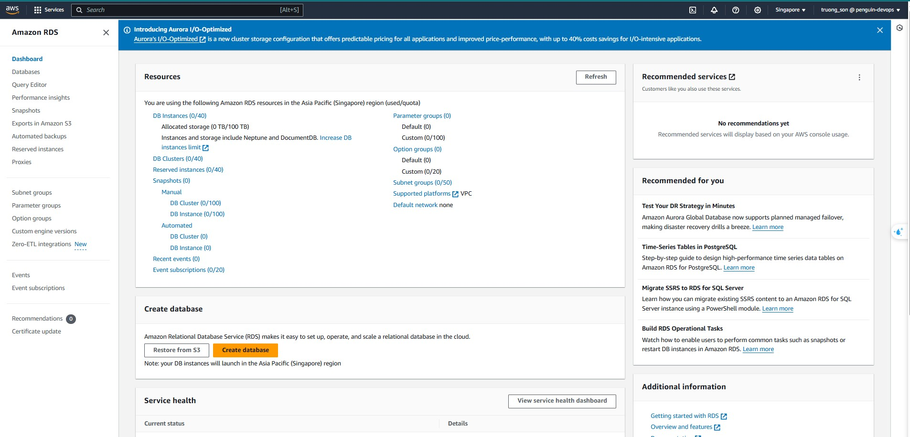
2. Chọn Subnets groups ở sidebar và nhấn **Create DB subnet group**
   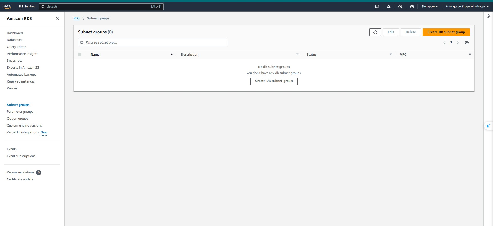
3. Điền các thông tin cần thiết, chọn VPC và **private subnet** sau đó nhấn **Create**
   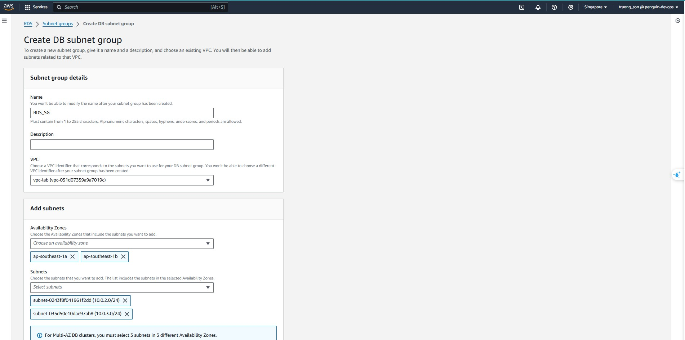

{}
Nhớ điền description nếu không sẽ báo lỗi
{}
Tạo thành công DB subnet group
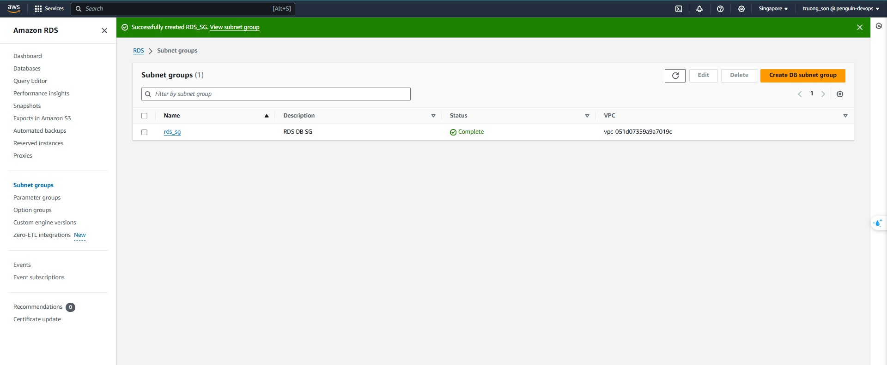 4. Chọn **Databases** ở sidebar và nhấn **Create database** để tạo RDS  
_Thực hiện theo các bước (optional)_
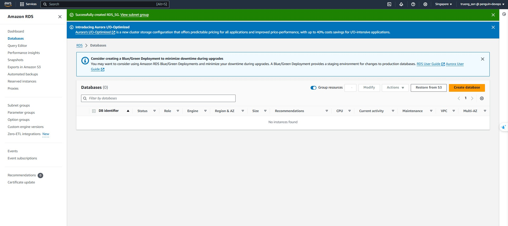
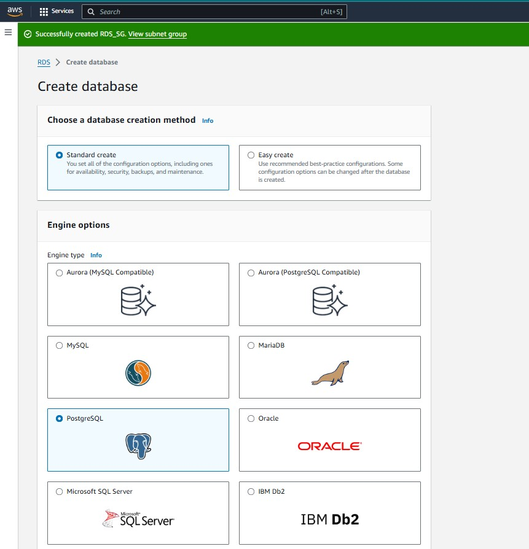
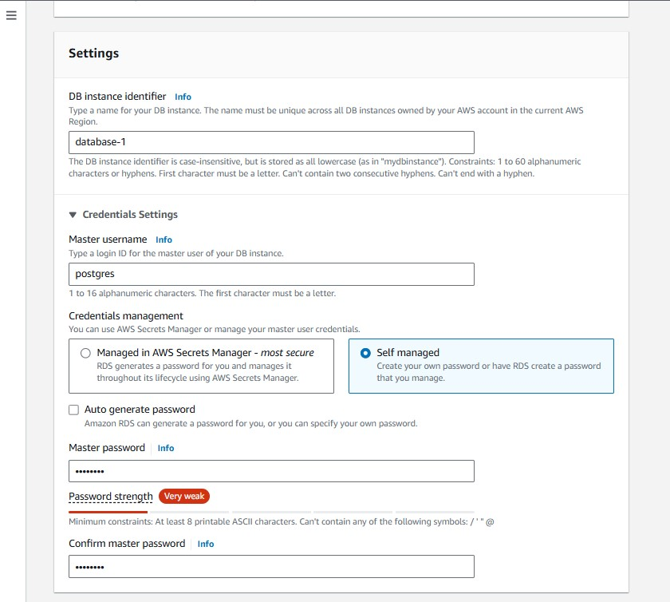
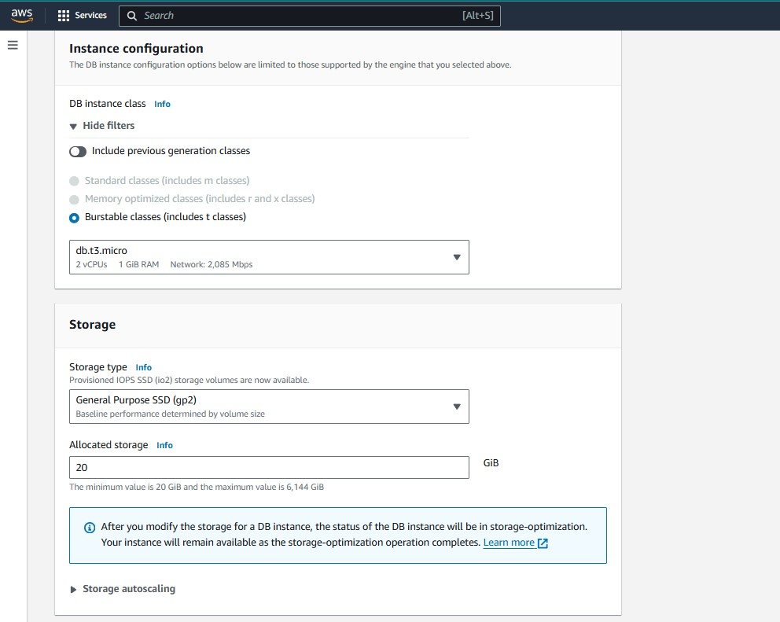
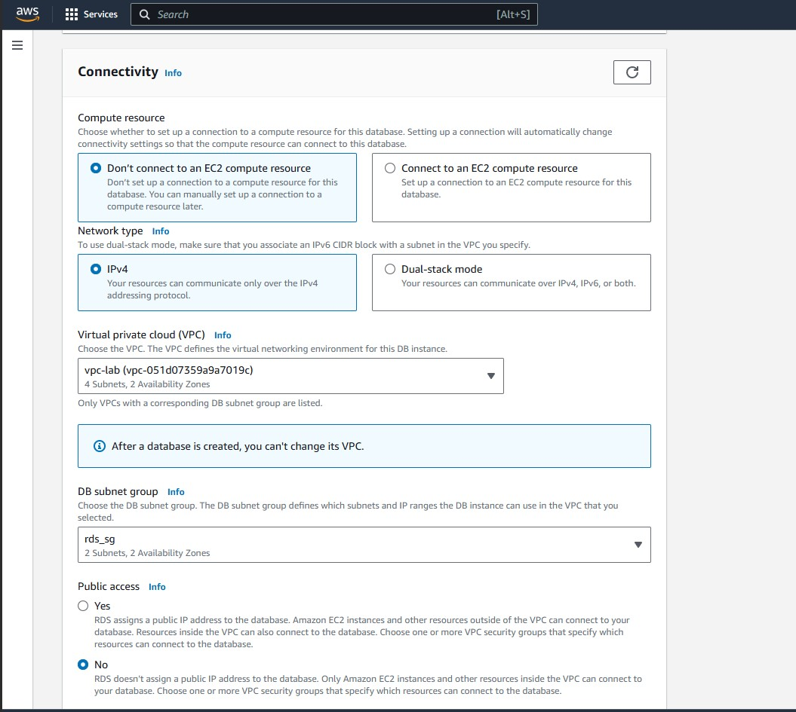
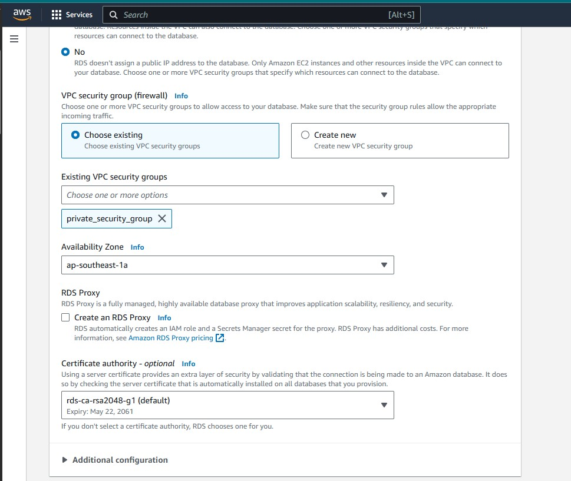
{}
Nhớ xem kỹ phần tính tiền trước khi tạo
{}
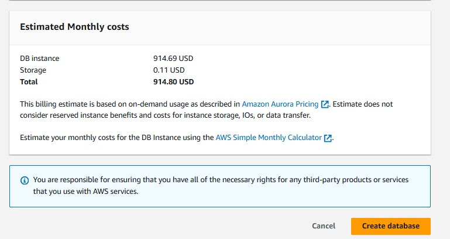
Xem lại thông tin và nhấn **Create database**:
Đợi 1 lúc để RDS có thể tạo thành công, sau đó **Lưu lại RDS endpoint** để dùng cho kết nối.
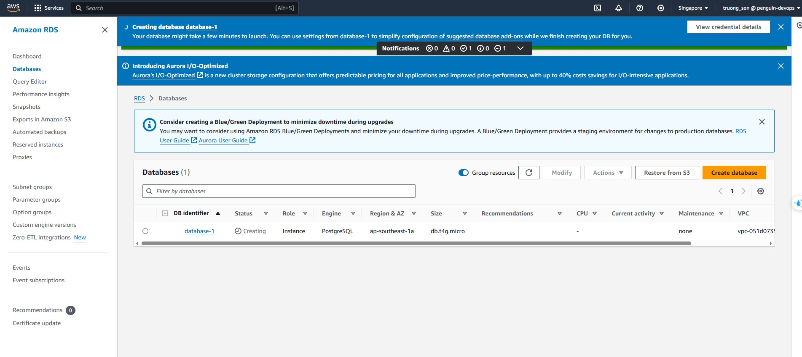
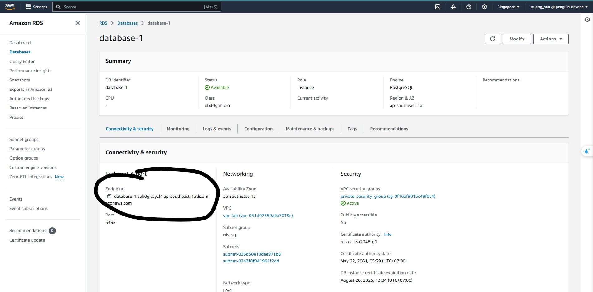
Đã khởi tạo xong RDS.
