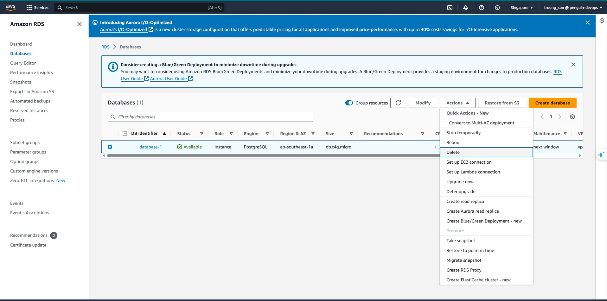
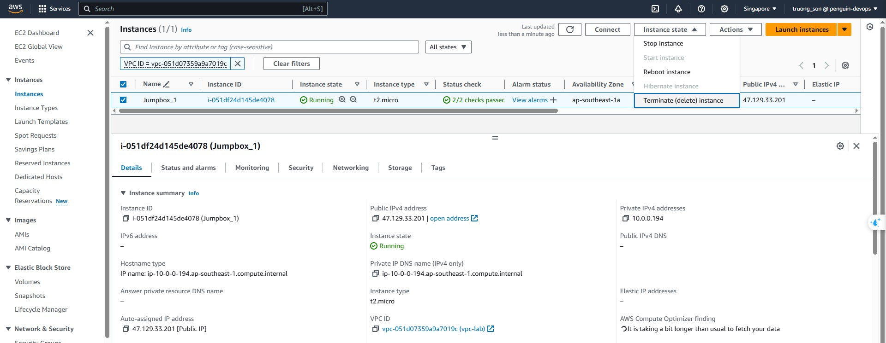
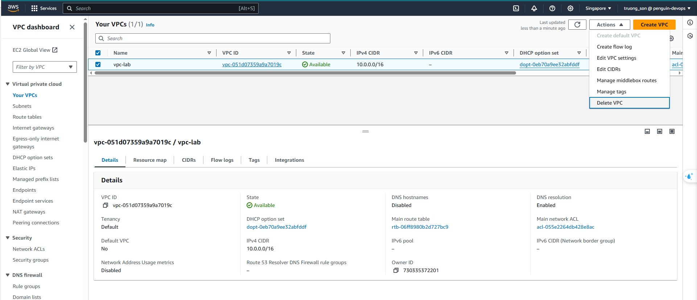

+++
title = "Dọn dẹp tài nguyên"
date = 2024
weight = 4
chapter = false
pre = "<b>4. </b>"
+++

- [Xóa RDS](#xóa-rds)
- [Xóa EC2](#xóa-ec2)
- [Xóa VPC](#xóa-vpc)

#### Xóa RDS

1. Vào RDS, chọn RDS cần xóa, chọn Actions sau đó chọn Delete
   
2. **Đợi 1 lúc để RDS xóa hoàn toàn**

#### Xóa EC2

Vào EC2, chọn EC2 cần xóa, chọn Instance state sau đó chọn Terminate (delete) instance
 2. **Đợi 1 lúc để EC2 xóa hoàn toàn**

#### Xóa VPC

Vào VPC, chọn VPC cần xóa, chọn Actions sau đó chọn Delete VPC

{}
Nếu chưa thể xóa do vẫn còn các tài nguyên phụ thuộc, hãy xóa các tài nguyên phụ thuộc trước sau đó xóa VPC
{}
